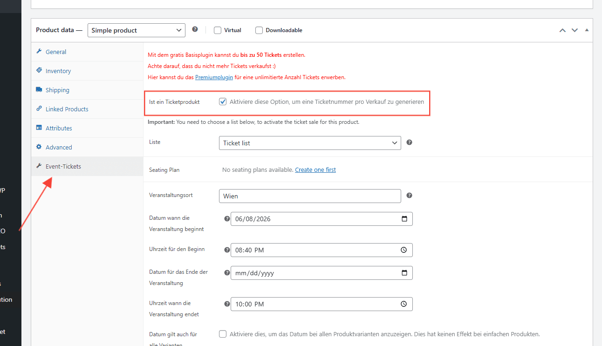
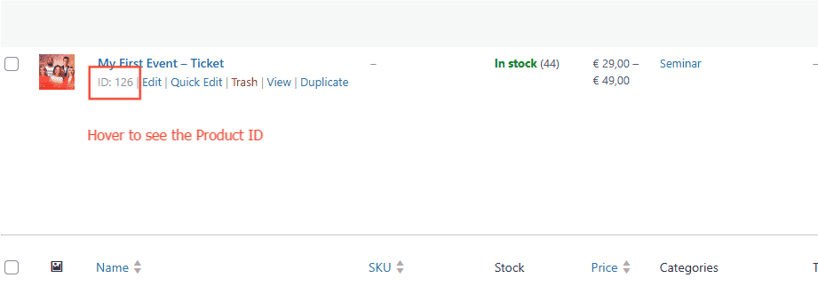
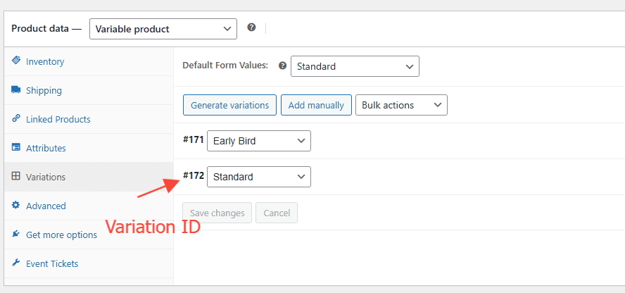

# Emotions
## Getting Started

This document covers everything you need to manage your event ticketing system day to day.

---

## Stack

| Component                                       | Role                                              |
| ----------------------------------------------- | ------------------------------------------------- |
| WordPress + WooCommerce                         | Core platform & order management                  |
| Stripe                                          | Payment processing                                |
| Event Tickets with Ticket Scanner *(Vollstart)* | QR code tickets, check-in scanner, attendee lists |
| Custom Emotions theme                           | Design & layout                                   |

---

## Creating an Event

Each event is a **WooCommerce product** with ticket functionality attached.

1. Go to **Products → Add New**
2. Set the product name, price, and description
3. Set stock quantity = number of available tickets (WooCommerce handles sold-out automatically)
4. In the **Event Tickets** meta box (below the product editor), configure:
   - Event date & time
   - Any additional ticket information to display on the PDF
5. Publish

> I recommend keeping the "Customer can choose the day", "Request a value for each ticket" , "The value for each ticket is mandatory" and similar option unchecked, so it is a simple ticket purchase for the customer and no option to set on their side.

To run multiple events simultaneously, simply create multiple products. Each is independent.

### Finding the Product ID

You'll need the product ID to wire up the Buy Button on any page. To find it:

1. Go to **Products** in the WordPress admin
2. Hover over the product name — the ID appears in the URL shown at the bottom of the browser (e.g. `post=9441`)
3. Note it down — you'll enter it in the Buy Button widget

---

## Adding a Buy Button to a Page

The **Buy Button** is a custom Elementor widget that links directly to a specific ticket product and sends the customer straight to checkout.

**Example page:** [buy-button-example](https://emotions-events.at/buy-button-example/) — **Example product:** [product-ticket-test](https://emotions-events.at/product/product-ticket-test/)

To add or configure a Buy Button:

1. Edit the page in **Elementor**
2. Drag the **Buy Button** widget onto the page (find it in the widget panel)
3. In the **Content** tab, fill in:

| Field                         | What to enter                                                                                                  |
| ----------------------------- | -------------------------------------------------------------------------------------------------------------- |
| **Type**                      | Leave as `Primary`                                                                                             |
| **Product ID**                | The WooCommerce product ID for this event (see above)                                                          |
| **Variation ID** *(optional)* | Only needed if the product has variations (e.g. VIP / Standard ticket types) — leave empty for simple products |
| **Redirect to checkout**      | Keep enabled — sends the customer directly to checkout instead of the cart                                     |
| **Text**                      | The button label, e.g. `Jetzt Ticket kaufen`                                                                   |
| **Size / Alignment**          | Adjust to fit the page layout                                                                                  |

> The quantity a customer can select is handled at checkout, and alos predefined in the Buy Button as well.
>

4. Click **Publish** / **Update**

---

## Payment Methods

Payment methods are configured in **WooCommerce → Settings → Payments**.

From there you can enable or disable available payment methods (credit card, Apple Pay, Google Pay, bank transfer, etc.). Each method may have its own settings — click **Manage** next to it to configure.

Stripe transaction fees are set by Stripe and visible in your [Stripe Dashboard](https://dashboard.stripe.com). They are not controlled from WordPress.

---

## Managing Orders & Attendees

### Attendee list
Go to **Event Tickets → Tickets** in the WordPress admin. You can:
- View all ticket holders per event
- See check-in status (scanned / not yet scanned)
- Export the list as CSV (name, email, ticket ID)

### Order management
Standard WooCommerce — go to **WooCommerce → Orders** to view, refund, or cancel individual orders.

### Refunds
Process refunds directly from the order detail page in WooCommerce. The amount is returned to the customer via Stripe automatically.

---

## Discount Codes

Managed natively in WooCommerce — no extra plugin needed.

Go to **WooCommerce → Coupons → Add Coupon**:
- Set a code, discount type (percentage or fixed amount), and expiry date
- Optionally limit usage (e.g. max 50 uses, or one per customer)

Customers enter the code at checkout.

---

## Checking In Attendees (QR Scanner)

1. On your phone, go to your WordPress admin → **Event Tickets → Scanner**
2. Select the event
3. Tap **Start Scanning** and point the camera at the attendee's QR code
4. The screen shows ✅ **Valid** (first scan) or ❌ **Already used** (duplicate)

Each ticket QR code is unique and can only be validated once, so forwarded tickets are automatically caught.

> **Tip:** For larger events, multiple people can scan simultaneously by logging into the admin on separate phones.

---

## After a Purchase — What the Customer Receives

After a successful payment, the customer:

1. Lands on the **order confirmation page** with their event details and a download button for each ticket PDF
2. Receives a **WooCommerce confirmation email** with their order summary

Each PDF ticket contains:
- Event name, date, and time
- Buyer name
- Unique QR code (one per ticket)

> If a customer buys 2 tickets, they receive 2 separate PDFs, each with its own unique QR code.

---

## Plugin Updates

The **Event Tickets with Ticket Scanner** plugin is maintained by Vollstart. When a WordPress or plugin update is available:
- Always test updates on a staging environment before applying to the live site
- If anything breaks after an update, roll back and get in touch

---

## Questions & Support

For anything technical, contact:
📧 contact@wolfthemes.com
